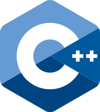
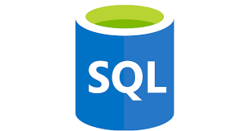
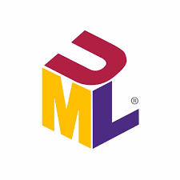

<!-- Description about me -->
<h2 align="center"> 🤔 About me 👨‍💻 </h2>

Hello there! 
 👋 My name is <b>Lázaro</b>, you can find me on GitHub as ldelpino 🕵🏼‍♂️.  I'm 27 years old and I come from the beautiful Cuba. 

I have a background in computer science, having graduated as a technician in informatics. Currently, I am in my final year of studying computer engineering at the Technological University of Havana "CUJAE". 

Computing has always been my passion, and my ultimate goal is to pursue a career in software development. I aspire to establish my own software development business and build a dedicated team of professionals. I want to immerse myself in creating cutting-edge software full-time. 

Programming, software engineering, architectural design, and business modeling are some of the areas I find fascinating. I am not just a robot coding 🤖; I am a real human who is constantly learning and striving to develop remarkable projects with ❤️. Along this journey, I look forward to meeting incredible peoples and growing together. 🚀

### 🧐 More About Me:
<table style="border: none;">
  <tr style="border: none;">
    <td style="border: none;">
      <ul>
        <li>
          🔭 I’m currently studying at **Computer Engineering at the Technological University of Havana "CUJAE"**
        </li>
        <li>
          🤝 I’m looking to participate in open source projects.
        </li>
        <li>
          🌱 I’m currently learning AI
        </li>
        <li>
          👨🏻‍💻 Most of my projects are available on [Github](https://github.com/ldelpino?tab=repositories)
        </li>
    </td>
  </tr>
</table>
   

<!-- languajes and skills section -->

<h1 align="center"> Languages/Frameworks I'm good at: </h1>

  <code></code>
  <code></code>
  <code></code>
  <code></code>
  <code></code>
  <code></code>
  <code></code>
  <code></code>
  <!-- Nuevos -->
  <code></code>
  <code></code>
  <code></code>
  <code></code>
  <code></code>

 

<h1 align="center"> Languages/Frameworks I'm know the basics: </h1>

  <code></code>
  <code></code>
  <code></code>
  <code></code>

 

<h1 align="center"> Languages/Frameworks/Tools I'm learning: </h1>

  <code></code>
  <code></code>
<!-- add python -->

 

<h1 align="center"> Environments I work with: </h1>

  <code></code>
  <code></code>
  <code></code>
  <!--<code></code>-->

 

<!-- GitHub stats section -->

## 📊 Github stats

<!-- Bassed on: https://github.com/anuraghazra/github-readme-stats -->

   
  
  
   
  <b>Note:</b> Top languages is only a metric of the languages my public code consists of and doesn't reflect experience or skill level.

<!-- Projects section -->

## 📘 My top open source projects

<!-- Bassed on: Repo info cards - https://github.com/anuraghazra/github-readme-stats -->

  

    
    

  
&#8192;

  

    
    
  

&#8192;

&#8192;

  

<!-- last refresh of readme section -->

Last refresh: <b>Monday, November 7, 12:19 AM GMT-5</b>

<!---
ldelpino/ldelpino is a ✨ special ✨ repository because its `README.md` (this file) appears on your GitHub profile.
You can click the Preview link to take a look at your changes.
--->
