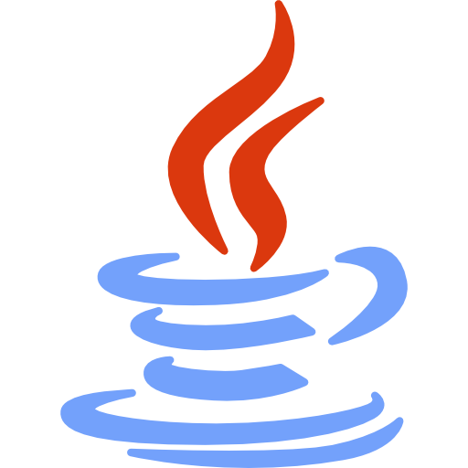
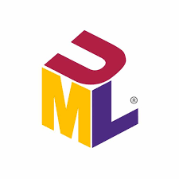
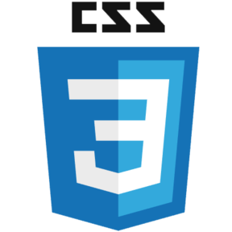
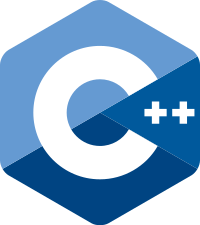
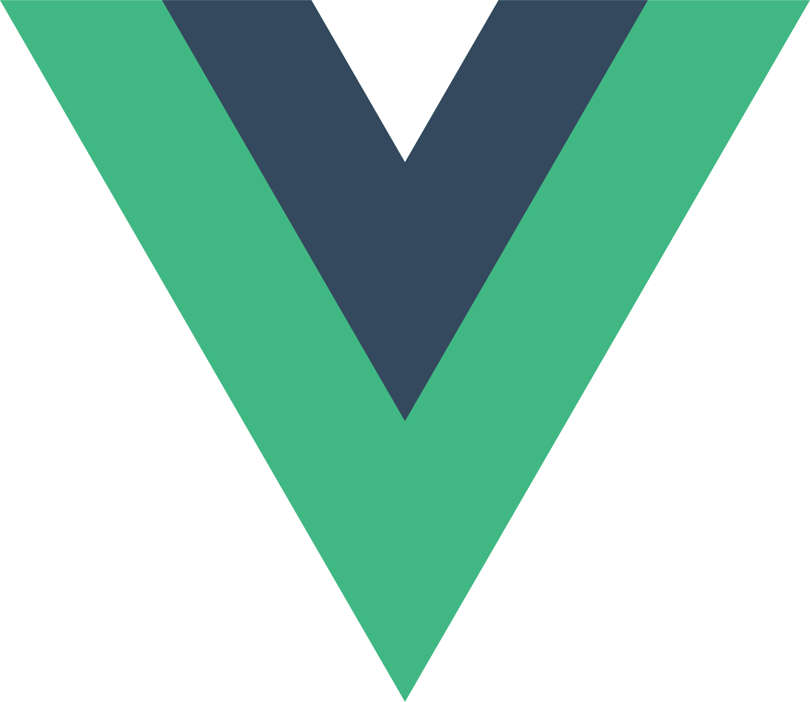

# 👨‍💻 About me ☕

Hello there!
 👋 My name is **Lázaro**, you can find me on GitHub as **ldelpino** 🕵🏼‍♂️.
I'm 28 years old and I come from the beautiful Cuba.

I have a background in computer science, having graduated as a technician in informatics. Currently, I am in my final year of studying computer engineering at the Technological University of Havana "CUJAE" and i`m working in the Genetic Engineering and Biotechnology Center CIGB as administrator of the Virtual Classroom and computer technician in the human resources training department

Computer science has always been my passion, and my current goal is to specialize in software development. I aspire to establish my own software development business and build a dedicated team of professionals. I want to immerse myself in creating cutting-edge software full-time.

Programming, software engineering, architectural design, and business modeling are some of the areas I find fascinating. I am not just a robot coding 🤖; I am a real human who is constantly learning and striving to develop remarkable projects with ❤️. Along this journey, I look forward to meeting incredible peoples and growing together.🚀

## 🧐 More About Me

- 🔭 Currently studying at Computer Engineering at the Technological University of Havana "CUJAE"
- 🤝 Looking to participate in open source projects.
- 🌱 Currently learning the use of application Generators
- 👨🏻‍💻 Most of my projects are available on my [Github](https://github.com/ldelpino?tab=repositories) account.
- Working in my Thesis.

<!-- languajes and skills section -->

## Languages/Frameworks I'm good at

  <code></code>
  <code></code>
  <code></code>
  <code></code>
  <code></code>
  <code></code>
  <code></code>
  <code></code>
  <code></code>
  <code></code>
  <code></code>
  <code></code>
  <code></code>
  <code></code>

## Languages/Frameworks I'm know the basics

  <code></code>
  <code></code>
  <code></code>

## Languages/Frameworks/Tools I'm learning

  <code></code>
  <code></code>
  <!-- <code></code> -->

## Environments I work with

  <code></code>
  <code></code>
  <code></code>
  <code></code>

<!-- GitHub stats section -->

## 📊 Github stats

<!-- Bassed on: https://github.com/anuraghazra/github-readme-stats -->

  
  

  **Note** Top languages is only a metric of the languages my public code consists of and doesn't reflect experience or skill level.

<!-- Projects section -->

## 📘 My top open source projects

<!-- Bassed on: Repo info cards - https://github.com/anuraghazra/github-readme-stats -->

  

    
    

  

    
  

  

<!-- last refresh of readme section -->

Last refresh: **Tuesday, October 29, 10:30 AM GMT-5**

<!---
ldelpino/ldelpino is a ✨ special ✨ repository because its `README.md` (this file) appears on your GitHub profile.
You can click the Preview link to take a look at your changes.
--->
